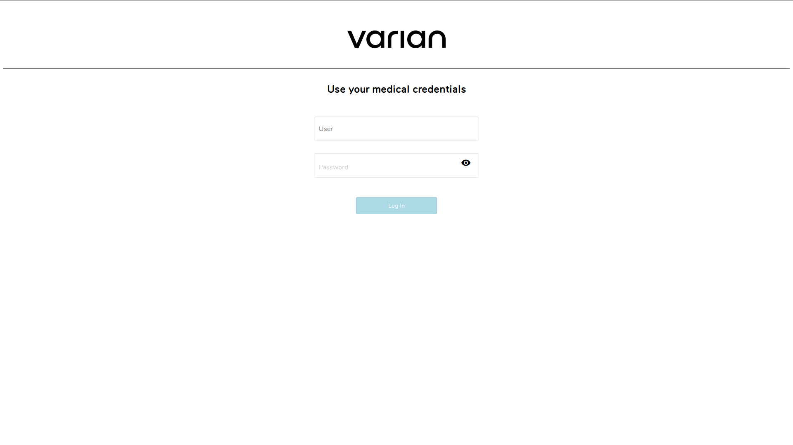
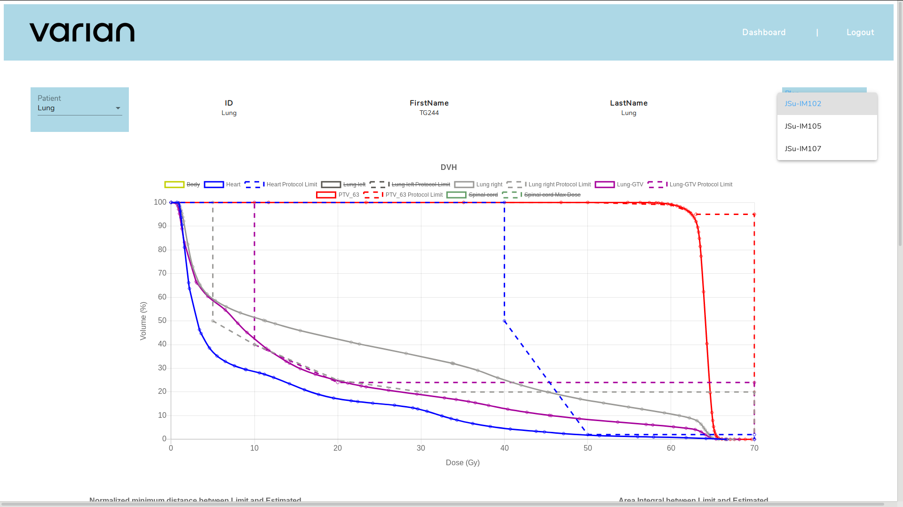
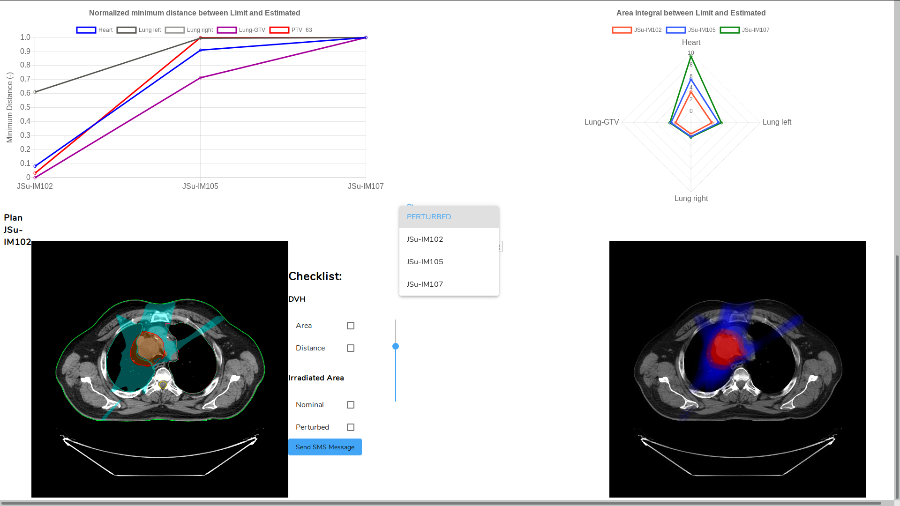
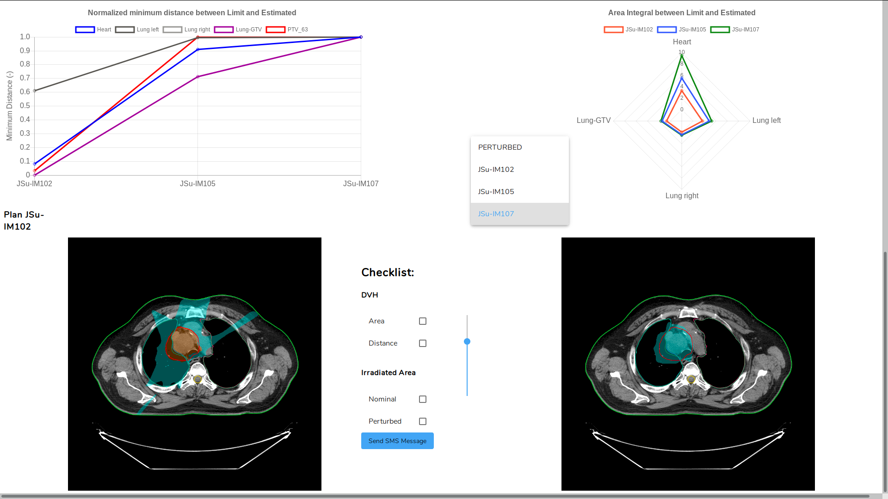
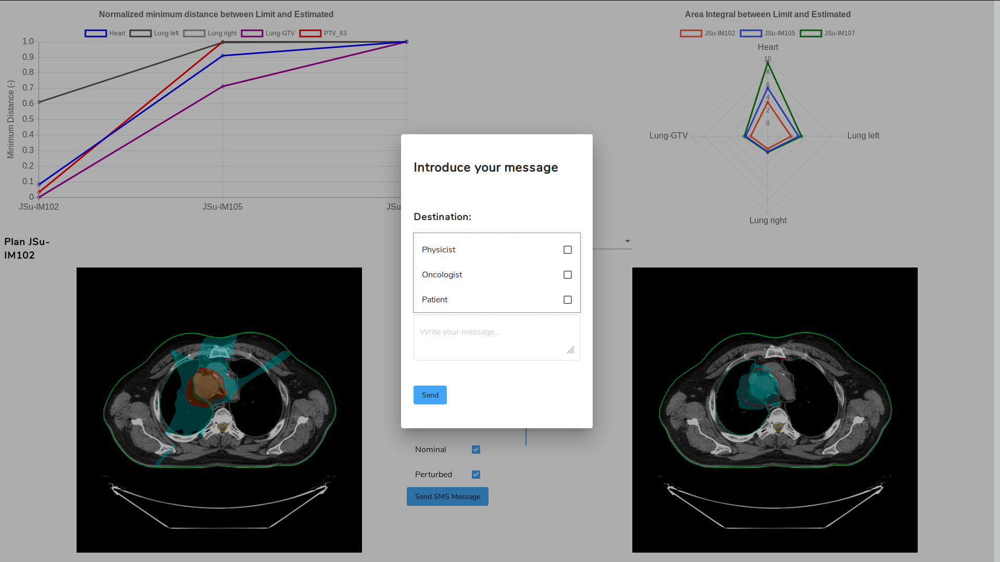

# Makers UPV for Varian @ HackJunction 2019, Helsinki

This work was produced during HackJunction 2019, 15-17 November, and submitted for the Varian Medical Systems challenge 'Effective Radiation Therapy Plan Review'. More info can be found here: https://2019.hackjunction.com/challenges/effective-radiation-therapy-plan-review

<pre>
Credentials:
User: Doc
Password: 123456
</pre>

# Introduction

Radiation therapies are planned in a two step process, where firstly the physicist optimizes the arrangement of ionizing radiation, and secondly the oncologist reviews and approves -or not- the plan designed by the physicist. During the treatment, target regions must obtain enough therapeutic radiation while avoiding too much radiation to critical organs and normal tissue.
The sharp gradients in Intensity-Modulated Radiation Therapy cause the treatments to be very sensitive to uncertainties; and these can arise from organ motion, setup errors or density errors. For this reason, the plan has to be robust enough against these uncertainties to ensure that the radiation requirements are met.
The reviewing process by the oncologist can take many resources as it has to be physically at the workstation to review the plan -often with the physicist-, check different variables such as dose distribution, quality of radiation source positioning or volume definitions, and communicate possible changes or suggestions to the physicist.

# Our approach

Our project aims to improve the way data are handled and visualized to aid decision-making processes by the oncologist, reduce the time spent on the plan review phase, and enhance the framework of information exchange between oncologist, physicist and patient.
We have developed a web app system asking for login credentials, allowing the oncologist to access the data anywhere and from any device. The oncologist has the option to filter the information for each patient and plan. The visualization of the data has been focused on two markers for plan robustness; one for inter-fraction uncertainties and another for intra-fraction uncertainties:

* DVH and maximum recommended dose for critical organs have been visualized and compared between plans to assess which plan has higher impact on non targeted areas;
* The nominal location of the radiation is showed alongside the perturbed location taking into account small variations on the patient location during the radiation procedure to evaluate how robust are the plans against these uncertainties.

Lastly, the web app has a checklist informing the oncologist of the steps that have to be performed, with the option of sharing information instantly via SMS with either the physicist or the patient.

# Future Work?

We believe that the maximum recommended dose for critical organs could be individualized for each patient considering special conditions such as organ removals or amputations, instead of using the generally recommended by expert institutions.
Also, the radiation dose on non targetted areas could be better calculated by taking into account the section of organ volume that goes into the radiation region due to intra and inter-fraction uncertainties.
Lastly, we believe that future applications of cloud computing and machine learning in the field could be further investigated.

# Images

